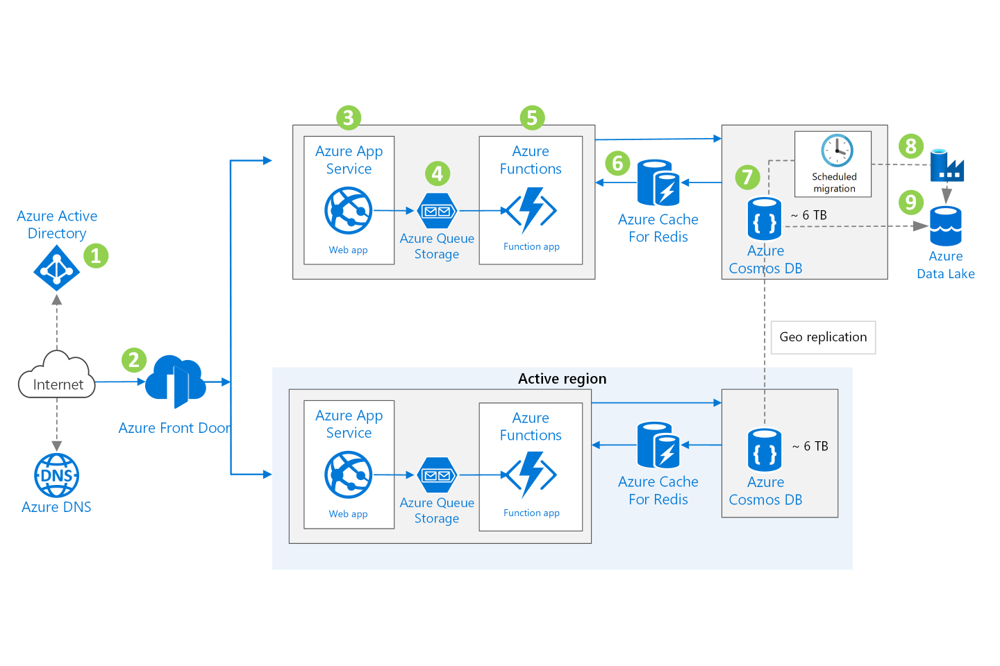

# **Optimized storage – time based with Data Lake.**

## **Azure Explanation**
#
### **This script creates resources based on below architecture :**
#

#
### **Potential use cases :**
#
The architecture may be appropriate for any application that uses massive amounts of data that must always be available. Examples include apps that:

* Track customer spending habits and shopping behavior.
* Forecast weather.
* Offer smart traffic systems or implement smart traffic systems or use smart technology to monitor traffic.
* Analyze manufacturing Internet of Things (IoT) data.
* Display smart meter data or use smart technology to monitor meter data.

### **Assumptions in the architecture :**
#
1. The client authenticates with Azure Active Directory (Azure AD) and is granted access to web applications hosted on Azure App Service.
2. Azure Front Door, a firewall and layer 7 load balancer, switches user traffic to a different Azure region in case of a regional outage.
3. Azure App Service hosts websites and RESTful web APIs. Browser clients run AJAX applications that use the APIs.
4. Web APIs delegate function apps to handle background tasks. The tasks are queued in Azure Queue Storage queues.
5. The function apps hosted by Azure Functions perform the background tasks, triggered by the queued messages.
6. Azure Cache for Redis caches database data for the function apps. This offloads database activity and speeds up the function apps and web apps.
7. Azure Cosmos DB holds 3 to 4 months of the most recent data used by the web applications.
8. Data Lake Storage holds historical data used by the web applications.
Periodically, Azure Data Factory moves data from Azure Cosmos DB to Azure Data Lake to reduce storage costs.

### *Components*
#
1. [Azure Active Directory (Azure AD)](https://azure.microsoft.com/services/active-directory "Azure Active Directory (Azure AD)") is a multi-tenant identity and access management service that can synchronize with an on-premises directory.
2. [Azure DNS](https://azure.microsoft.com/services/dns "Azure DNS" ) is a high-availability hosting service for DNS domains that provides apps with fast DNS queries and quick updates to DNS records. Managing Azure DNS is like managing other Azure services, and uses the same credentials, APIs, tools, and billing.
3. [Azure Front Door](https://azure.microsoft.com/services/frontdoor "Azure Front Door") is a secure content delivery network (CDN) and load balancer with instant failover. It operates at the edge close to users, accelerating content delivery while protecting apps, APIs, and websites from cyber threats.
4. [Azure App Service](https://azure.microsoft.com/services/functions "Azure App Service") is a fully managed service for building, deploying, and scaling web apps. You can build apps using .NET, .NET Core, Node.js, Java, Python, or PHP. Apps can run in containers or on Windows or Linux. In a mainframe migration, the front-end screens or web interface can be coded as HTTP-based REST APIs. They can be segregated and can be stateless to orchestrate a microservices-based system. For more information on web APIs, see [RESTful web API design](https://docs.microsoft.com/en-us/azure/architecture/best-practices/api-design "RESTful web API design").
5. [Azure Functions](https://azure.microsoft.com/services/functions "Azure Functions") provides an environment for running small pieces of code, called functions, without having to establish an application infrastructure. You can use it to process bulk data, integrate systems, work with IoT, and build simple APIs and microservices. With microservices, you can create servers that connect to Azure services and are always up to date.
6. [Azure Storage](https://azure.microsoft.com/product-categories/storage) is a set of massively scalable and secure cloud services for data, apps, and workloads. It includes Azure Files, Azure Table Storage, Azure Queue Storage, and Azure Data Lake Storage. Azure Files is often an effective tool for migrating mainframe workloads.
7. [Azure Queue Storage](https://azure.microsoft.com/services/storage/queues/) provides simple, cost-effective, durable message queueing for large workloads.
8. [Azure Table Storage](https://azure.microsoft.com/services/storage/tables/) is a NoSQL key-value store for rapid development that uses massive semi-structured datasets. The tables are schemaless and adapt readily as needs change. Access is fast and cost-effective for many types of applications, and typically costs less than other types of keyed storage.
9. [Azure Cache for Redis](https://azure.microsoft.com/services/cache) is a fully managed in-memory caching service and message broker for sharing data and state among compute resources. It includes both the open-source Redis and a commercial product from Redis Labs as managed services. You can improve performance of high-throughput online transaction processing applications by designing them to scale and to make use of an in-memory data store such as Azure Cache for Redis.
10. [Azure Cosmos DB](https://azure.microsoft.com/services/cosmos-db) is Microsoft's globally distributed, multi-model database that enables your solutions to elastically and independently scale throughput and storage across any number of geographic regions. It offers throughput, latency, availability, and consistency guarantees with comprehensive service level agreements (SLAs).
11. [Azure Data Factory](https://azure.microsoft.com/services/data-factory/) is a managed service that orchestrates and automates data movement and data transformation.
12. [Azure Data Lake Storage](https://azure.microsoft.com/services/storage/data-lake-storage/) is secure and massively scalable data lake functionality built on Azure Blob Storage.


### **Considerations**
#
* Historical data needs to be migrated to Azure Data Lake as a one-time activity to ensure cost effectiveness of the solution.
* Application developers must implement data migration routines that use Azure Data Factory to move data from Azure Cosmos DB to Azure Data Lake.
* If you're migrating data from old storage system, you may need to write routines to copy a portion of old data to Cosmos DB. Make sure that you have timestamp and copy flags to track the progress of migration of data.
* You can further optimize the overall architecture by replacing Azure Redis cache with Azure Cosmos DB integrated cache.

### **Terraform Explanation**
#
This code is parameterized and we are using different modules for every Azure Resource. This allows us to manage our code along with enabling the reusability. The parent directory **Data Lake Deployment** contains two subfolders :

1. terraform-modules
     * This directory contains all the modules.
     * Any variable conditional needs to be checked in the variable.tf file under respective module
2. terraform-resources
    * This folder has these files :
        * main.tf -> This file contains all the resources that we are going to deploy.
        * variables.tf -> Variables are defined in this file.
        * terraform.tfvars -> Tfvars file is automatically loaded without any additional option. This is the file where you need to update your resource values\names.

### **Usage :**
#
**Things to keep in mind are :**

1. We are using Azure BLOB as backend configuration, so you need to ensure the storage account and container mentioned in the backend configuration exists.
2. Since we are using data block to fetch key vault secrets, where we store all our sensitive information. The key vault and the secrets should already exist.
3. Data lake linked service is configured using *"Data Lake Deployment\terraform-modules\data-lake\main.tf"* file. I haven't written code to implement data set because that can vary depending on the requirement. But this can be easily added based on the requirement.
3. App service site config is configured using line number 22 to 26 under *"Data Lake Deployment\terraform-modules\webapp\main.tf"* file. The application framework can be changed using these lines (ex: Java, Python, DotNet etc.)

To run this example, simply follow to steps below:

1. Open **terraform.tfvars** file under **terraform-resources** folder and update parameters based on your requirement. It can be region\resource group\SKU.
2. Open command prompt or powershell and change the working directory to terraform-resources folder, if the terminal is opened in *Data Lake Deployment* directory, use :

``` 
  cd terraform-resources

  terraform init
  terraform plan
  terraform apply

```
### **Explanation :**
#
1. Terraform init -> It initializes the directory and downloads required provider along with configuring the module.
2. Terraform plan -> This helps you verify the code is going to deploy the resources as expected. This also ensures we don't face any unwanted surprise. This isn't mandatory, but a recommended step.
3. Terraform apply -> This step applies the resources specified in this code. This will ask you to approve this later. We can skip manual approval by using --auto-approve parameter.

### **Best Practices & Recommendations**
#
1. Use Terraform workspaces for easier management of the deployments. This can also help us manage Dev, UAT and Production deployments instead of creating multiple state files\directories.
2. If you are creating new resources\variables. Ensure naming convention is easily relatable, since we have a lot of variables in this code.
3. Use conditionals to avoid unwanted surprises.
